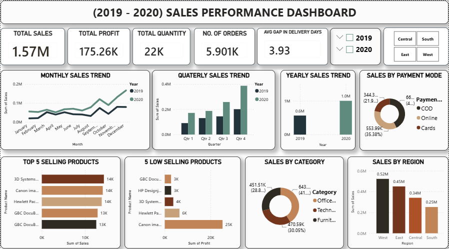

# Internship_Task1_-Sales-performance-dashboard-
An interactive Power BI Sales Performance Dashboard developed to analyze sales, profit, quantity, delivery performance, payment modes, regions, customer segments, and sales trends.
#tools
1. Microsoft excel
2. Microsoft PowerBI (with DAX commands)

#The features of sales dashboard
1. The 5 KPI's
   i.) Total no. of sales
   ii.) Total no. of quanity
   iii.) Total Profit
   iv.) Average no. gaps in delivery days
   v.) Total no. of orders
3. #SALES ANALYSIS
4. Sales by payment_mode
5. Sales by region
6. Sales by segments
7. Monthly sales trend
8. Quaterly sales trend
9. Yearly sales trend
10. Top 5 selling products
11. 5 low selling products
12. Sales by category
13. Dashboard preview
   
#Powerbi 

